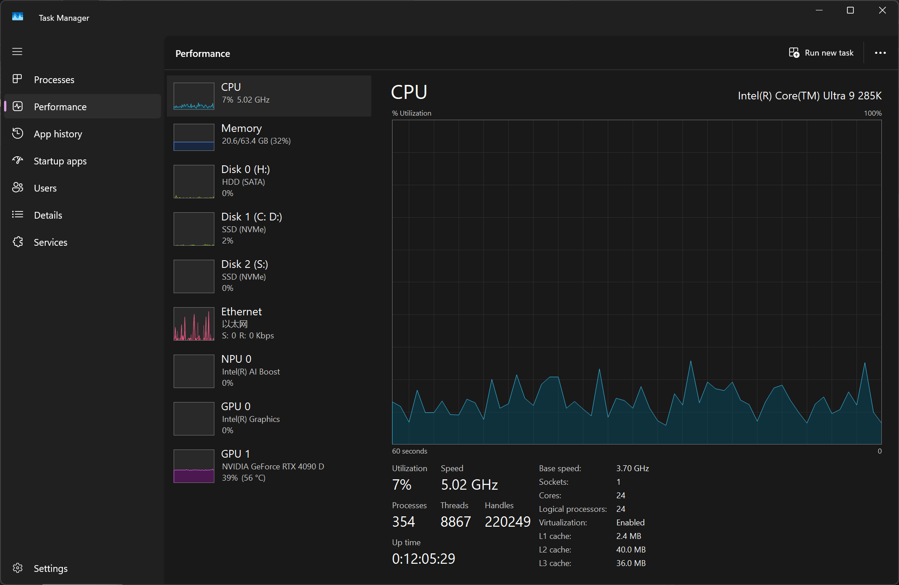

# 第 1 章   引论

学习操作系统前的第一件事，不妨深刻了解一下自己的电脑的配置。

最简单的办法是：键盘上按下 `Ctrl` + `Alt` + `Delete`，然后点击 Task Manager（任务管理器）。

然后左侧标签菜单栏切换 Performance（性能）界面。

「核心（有时也可简称「核」）」是实际进行计算的物理单元，而「逻辑处理器」则是操作系统看到的、可以分配任务的单元。

那么，如图所示，这台电脑的 Cores（核心）为 24，表示这台电脑的 CPU 内部有 24 个「物理计算单元」。另外，Logical processors（逻辑处理器）为 24，表明这颗 CPU 没有启用超线程（Hyper-Threading）技术，或者至少操作系统报告为与核心数相同。

> 超线程（Hyper-Threading，简称 HT）技术是 Intel 公司开发的硬件技术，通过让一个物理 CPU 核心同时处理多个线程，将该物理核心模拟成两个或多个逻辑核心，从而提高 CPU 对多任务的并行处理能力和资源利用率。 该技术在一定条件下能显著提升性能，但实际效果取决于应用软件对多线程的支持以及系统对超线程的优化程度。
>
> 这里的 24 核，24 个逻辑处理器表明这颗 Ultra 9 285K 可能是混合架构的设计，并且其中的部分或全部核心没有使用超线程技术。对于高性能的性能核（P-Cores）和能效核（E-Cores）混合设计来说，这是可能的。

拥有 24 个独立的计算单元，能同时处理 24 个不同的任务流，这在多任务处理和专业应用（如视频编辑、3D 渲染、复杂编程编译）方面非常强大。
