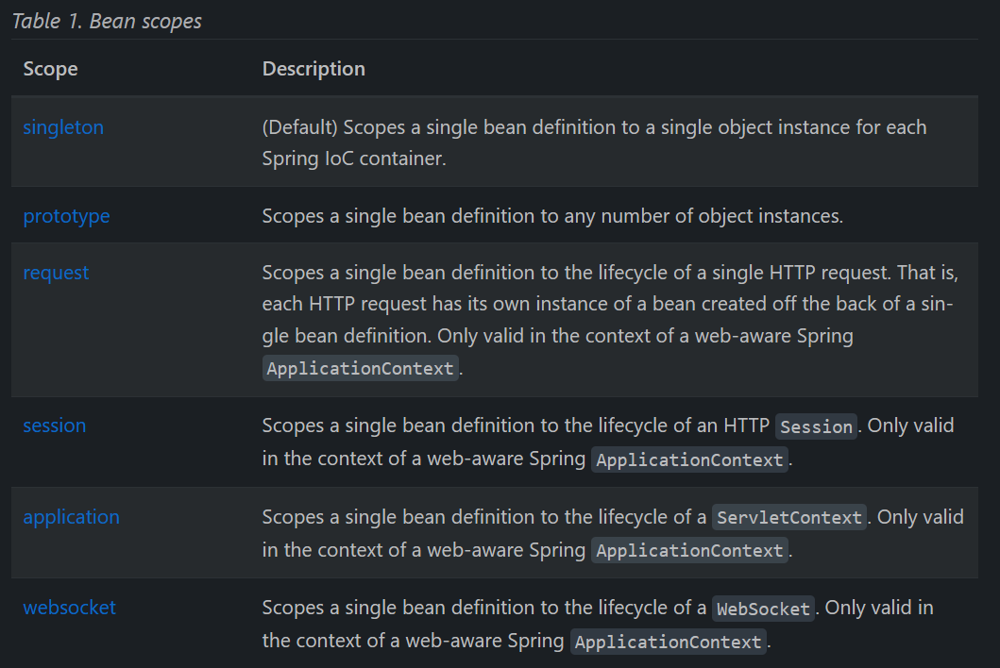

-   singleton：默认是单例，一个 IoC 容器内部仅此一个
-   prototype：原型，多实例
-   request：仅存在于 Spring Web 应用中，每个请求都会新建一个属于自己的 bean 的实例
-   session：仅存在于 Spring Web 应用中，一个 HTTP session 中有一个 bean 的实例。
-   aplication：仅存在于 Spring Web 应用中，整个 `ServletContext` 生命周期里只有一个 bean。
-   websocket：仅存在于 Spring Web 应用中，一个 `WebSocket` 生命周期内一个 bean 实例。