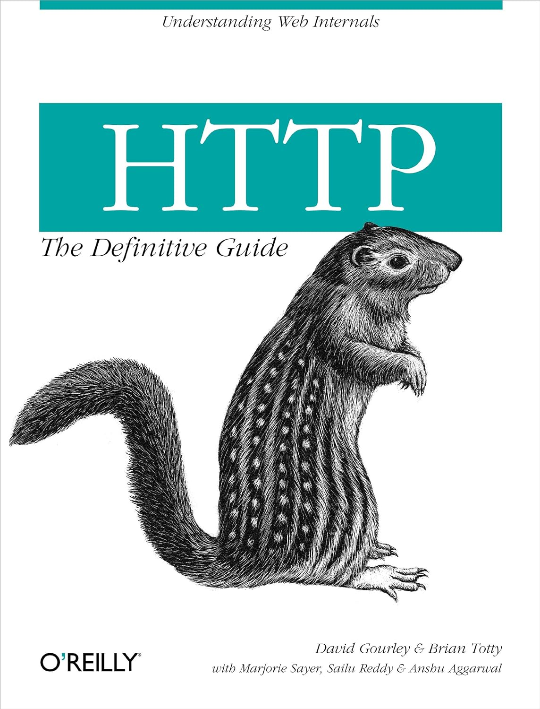

| 原书名   | *HTTP: The Definitive Guide*                                 |
| -------- | ------------------------------------------------------------ |
| 其它译名 | [中] HTTP 权威指南                                           |
| 作者     | [美] David Gourley, Brian Totty, Marjorie Sayer, Sailu Reddy, Anshu Aggarwal |
| 类型     | 计算机技术                                                   |
| 发表时间 |                                                              |
| 阅读时间 | 2024 年 5 月                                                 |
|          |                                                              |

# 第 1 章   HTTP 概述

>   【注意】本章注重的是==概述==，先暂时不必过于深究，后面章节自然有相应详述。

## 1.1   HTTP——因特网的多媒体信使

HTTP 使用了==可靠的==传输协议，无论对用户还是对开发人员而言，这都极其重要。

## 1.2   Web 客户端和服务器

查了一下本书成书于 2002 年，所以正文中还在介绍 IE（2024 年的如今，Microsoft 重推的是 Edge，其前身也正是 IE），甚至网景的 Navigator（如今火狐浏览器是 Navigator 的继任产品）也属实正常。21 世纪 20 年代称霸世界的浏览器毋庸置疑是 Chrome（根据统计大概稳占世界市场份额的 65%）。

## 1.6   连接

### 1.6.1   TCP/IP

TCP 提供了：

-   无差别的数据传输；
-   按序传输（数据总是会按照发送的顺序到达）；
-   未分段的数据量（可以在任意时刻以任意尺寸将数据发送出去）。

### 1.6.2   连接、IP 地址及端口号

我们来看几个 URL：

-   http://207.200.83.29:80/index.html
-   http://www.netspace.com:80/index.html
-   http://www.netspace.com/index.html

## 1.8   Web 的结构组件

### 1.8.4   隧道

# 第 2 章   URL 与资源

You'd use phone numbers for the fire department, the boss’s secretary, ==and your mother, who says you don’t call enough.==

You can tell the cab driver to take you to 246 McAllister Street, and he'll know what you mean (==even if he takes the long way==).

## 2.1   浏览因特网资源

# 第 3 章   HTTP 报文

## 3.1   报文流

# 第 11 章   客户端识别与 cookie 机制

