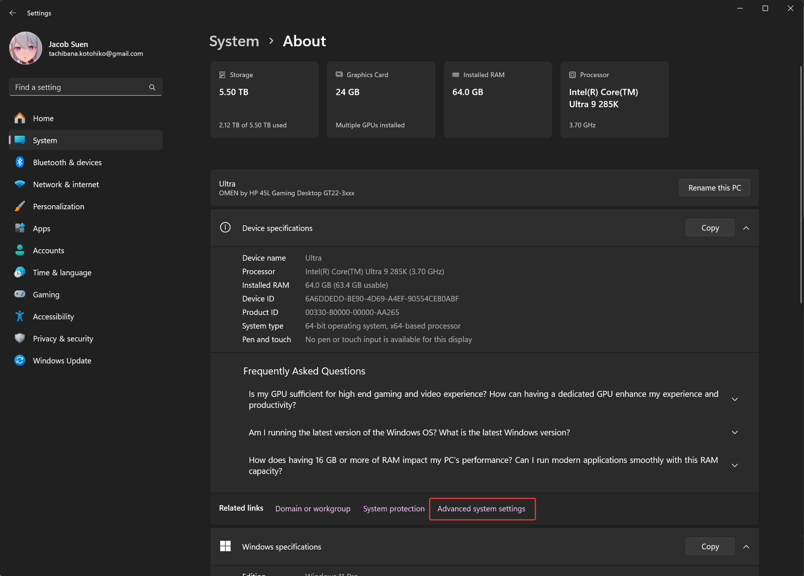

# 1   `Path` 环境变量的作用与用法


## 1.1   ✅ `Path` 环境变量的介绍

绝大多数开发者在 Java 的初学阶段，都会面临的一个问题，大概就包括「环境变量」。

这个问题其实涉及到两个领域的知识。其一为 Java 自身的运行方式；其二为 Windows 的配置。

首先来看 Windows 的配置，打开 Windows Settings >> System >> About


找到 Advanced system settings



随后点击 Environment Variables


我们可以看到，有好多如同数据字典一样的数据配置在这里。


在 Windows 操作系统中，**环境变量（Environment Variables）**是系统用来存储配置信息的一种机制，而其中非常重要的一个变量就是 `Path`。

`Path` 变量的主要作用是：指定一系列目录路径，操作系统会在这些路径中查找可执行程序。这也就意味着：

- 当你在命令行（CMD 或 PowerShell）中输入一个命令，比如 `python`、`git`、`javac` 等，系统就会在 `Path` 变量指定的目录里去查找这些可执行文件。
- 如果找到了，就运行；
- 如果找不到，就会报错（例如：`'python' is not recognized as an internal or external command, operable program or batch file.`


## 1.2   🔍 举个简单的例子


假设 `Path` 中包含了这些路径：

```makefile
C:\Windows\System32
C:\Program Files\Python311\
C:\Program Files\Git\bin
```

打开 CMD，输入 `python`

```cmd
Microsoft Windows [Version 10.0.26100.4484]
(c) Microsoft Corporation. All rights reserved.

C:\Users\tachi>python
```

系统就会按顺序在这些目录中查找 `python.exe`，一旦找到就执行。


## 1.3   📌 添加目录到 `Path` 的作用


如果安装了某个程序（比如 Node.js、Python、Java），它的可执行文件（如 `node.exe`、`python.exe`、`java.exe`）所在目录没有添加到 `Path`，你就只能通过完整路径来运行它，比如：

```
C:\Program Files\nodejs\node.exe
```

添加到 `Path` 后，就可以直接在任何地方用 `node` 来运行，非常方便。


## 1.4   🛠 如何查看 / 修改 `Path`


回到上面那张图，我们既可以编辑 User Variables 下的 `Path`，也可以编辑 System Variables 下的 `Path`。如果当前电脑只有自己用，那么在不切换用户的情况下，编辑哪个 `Path` 效果都是一样的。

点击 Edit 便可以查询与修改 `Path` 下所有的 Value 了。


可以看到很多路径，每个路径就是一个程序的安装位置。


## 1.5   ⚠ 注意事项


不要随意删除系统默认的路径（比如 `C:\Windows\System32`），否则可能会导致系统命令无法运行。


# 2   ☕ 配置 JDK 的环境变量


## 2.1   JDK 的 `bin` 目录

JDK 安装时，**Java 的核心工具（如 `java.exe`, `javac.exe`）** 会被放在 JDK 的 `bin` 目录下，比如：

```makefile
C:\Program Files\Java\jdk-21\bin
```

这些工具包括：

- `java.exe`：运行 Java 程序
- `javac.exe`：编译 Java 源码
- `javadoc.exe`、`jar.exe` 等其他工具


## 2.2   🚫 如果不配置 `Path` 会怎样？

### 2.2.1   早期版本

在**早期版本**中，如果你没有把 JDK 的 `bin` 目录加入到 `Path`：

你必须使用完整路径来运行命令，比如：

```cmd
C:\Program Files\Java\jdk-21\bin\javac Hello.java
```

非常麻烦，尤其是每次都要写一长串路径。

如果你直接在命令行输入：

```cmd
javac Hello.java
```

就会报错：

```cmd
'javac' is not recognized as an internal or external command,
operable program or batch file.
```

所以，我们需要把

```makefile
C:\Program Files\Java\jdk-21\bin
```

添加进系统的 `Path` 环境变量中，那么你可以在任意目录下直接使用 Java 的命令行工具：

```cmd
javac Hello.java
java Hello
```

系统会自动从 `Path` 中查找并运行对应的可执行文件。

### 2.2.2   后来版本

但是，幸运的是，Oracle JDK 在后续版本的安装过程中，为了提升用户体验，会自动在环境变量的 `Path` 下添加：

```makefile
C:\Program Files\Common Files\Oracle\Java\javapath
```


`java.exe`、`javaw.exe`、`javac.exe` 等文件实际上是符号链接，指向实际安装的 JDK/JRE 路径（例如 `C:\Program Files\Java\jdk-23\bin`）。

这个时候，倘若用户并未去手动添加 `Path` 路径，去执行 Java 命令，一样是可以执行的。


