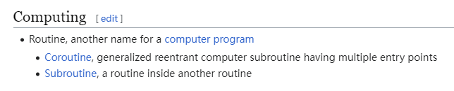

| 原书名   | *Core Java, Volume I: Fundamentals, Twelfth Edition* |
| -------- | ---------------------------------------------------- |
| 其它译名 | [中] Java 核心技术：卷 I 开发基础                    |
| 作者     | [美] Cay S. Horstmann                                |
| 类型     | IT 技术                                              |
| 发表时间 | 2021 年 10 月                                        |
| 阅读时间 | 第一次：2022 年 8 月                                 |
|          | 第二次：2024 年 5 月                                 |

> 注：如果文中没有提到任何其他人称，那么默认指的是随笔作者本人。

[TOC]

# 第 1 章   Java 程序设计概述

引言中提到了 Java 是唯一一个 “火出圈” 的编程语言。

## 1.1   Java 程序设计平台

本节言简意赅地指出了 Java 的优缺点，并强调 Java 早已不只是编程语言，同时也是一个「平台（*platform*）」。从作者的文字里可以看出，Java 在当年（1995 年左右）诞生之时还是具有着（对于后辈而言，比如我）难以想象的震撼力的。

## 1.2   Java 白皮书的关键术语

大学第一节程序设计基础课，老师就着重强调了下载软件（JDK、Eclipse 等）一定要去官网，养成好的习惯。如今看来，接触一门编程语言也是同理，要去官网搜集资料，比如文档。虽说很多时候都是要看英文，可能会有些痛苦，但是第一手资料的含金量还是无可比拟的。

> 白皮书链接（直接定位到介绍特性）：https://www.oracle.com/java/technologies/introduction-to-java.html#334

### 1.2.1   简单性（Simple）

求学之时，有一个经典思维误区，就是看到 Java 和 C++ 在语法上是那么地相似，并且 Java 比 C++ 晚很多年，于是草率地得出结论认为 “Java 抄袭 C++”。但是书中引用的 Java 白皮书给出的解释也很有道理，就是希望能更快捷地吸引 C++ 程序员来写 Java，毕竟当时确实很多 C++ 程序员。

### 1.2.3   分布式（Distributed）

>   **例程（[*routine*](https://en.wikipedia.org/wiki/Routine)）**：维基百科上对「例程」这个概念的解释很简单，就是「计算机程序」的又名。
>
>   
>
>   之前在那家港资银行上班的时候，就看到很多「*subroutine*」。说起来，在那个系统中，这个词语扮演的角色，也似乎确实就是 “程序” 的意思。

### 1.2.4   健壮性（Robust）

Java 有着很多 “很香” 的特性，对程序员有着很大的吸引力。尽管 Java 抽象了大量底层操作，但依然可以有效地检测出程序哪里存在问题，让程序员将更多精力放在业务逻辑的编写上，而非过多纠结底层问题。

本小节直接 “炸” 出来了很多难懂的概念，如下引用内容。

>   **动态（运行时）检测（*dynamic (runtime) checking*）**：
>
>   **指针模型**：
>
>   **重写内存（*overwriting memory*）**：

### 1.2.5   安全性（Secure）

### 1.2.10   多线程（Multi-threaded）

# 第 3 章   Java 的基本程序设计结构

## 3.3   数据类型

### 3.3.1   整型

### 3.3.3   `char` 类型

## 3.5   运算符

### 3.5.2   数学函数与常量

## 3.6   字符串

# 第 4 章   对象与类

## 4.1   面向对象程序设计概述

## 4.2   使用预定义类

## 4.4   静态字段与静态方法

### 4.4.1   静态字段

如果将一个字段定义为 `static`，那么这个字段并不出现在每个类的对象中。每个静态字段只有一个副本。可以认为静态字段属于类，而不属于单个对象。

### 4.4.4   工厂方法

# 第 5 章   继承

## 5.1   类、超类和子类

一个超类，并不是因为它优于子类或者拥有比子类更多的功能。恰恰相反，子类拥有比超类更多的功能。或者还可以这么理解：父类更 “模糊”，更 “抽象”，子类则代替父类，对一些 “模糊” 的问题具有着 “解释力”。

## 5.3   泛型数组列表

`ArrayList` 是一个有**类型参数（*type parameter*）**的**泛型类（*generic class*）**。为了==指定数组列表保存的元素对象的类型==，需要用一对「尖括号」将类名括起来追加到 `ArrayList` 后面。

### 5.3.1   声明数组列表

在 Java 10 中，引入了 `var` 关键字，可以避免重复写类名。

## 5.9   反射

### 5.9.1   `Class` 类

在程序运行期间，Java 运行时系统始终为==所有对象==维护一个**运行时类型标识（*runtime type identification*）**。这个信息会跟踪每个对象所属的类。虚拟机利用运行时类型信息选择要执行的正确方法。

# 第 6 章   接口、lambda 表达式与内部类

### 6.1.8   `Comparator` 接口

既然已经有 `Comparable` 接口了，为何还要再多个 `Comparator` 接口呢？有什么不同？

一个很显著的区别，`Comparable` 接口由需要进行比较的类直接实现，然后做比较的具体逻辑直接定义在该类中；而 `Comparator` 则是类外定义比较逻辑。按照这个逻辑也很好记 —— *Comparable* 是形容词，让一个类去实现这个同名接口，表示被它 “修饰”，所以可以直接挂在一个类上，也就是让这个类去 `implements Comparable`；另外 *Comparator* 是名词，是一个独立的存在。

## 6.2   lambda 表达式

# 第 7 章   异常、断言和日志

学习异常机制，是从初学到形成工程思维的第一个里程碑。初学时候难免都会按照 “理想思维” 去编写程序，但是现实生活明显不可能理想。

## 7.1   处理错误

异常处理的「任务」，就是将控制权从产生错误的地方转移到能够处理这种情况的一个「错误处理器」。

### 7.1.1   异常分类

> 【翻译吐槽】
>
> 英文原文：The `Exception` hierarchy also splits into two branches: exceptions that derive from `RuntimeExeption` and those that do not.
>
> 这句话其实原本的意思言简意赅，结果翻译却让人看的莫名其妙。

通常来讲，由编程错误导致的异常属于 `RuntimeException`；如果程序本身没有问题，但由于 I/O 错误之类的问题导致的异常属于其他异常。

继承自 `RuntimeException` 的异常包括以下问题：

- 错误的强制类型转换。
- 越界的数组访问。
- 访问 null 指针。

而非继承自 `RuntimeException` 的异常包括：

- 试图越过文件末尾继续读取数据。
- 试图打开一个不存在的文件。
- 试图根据给定的字符串查找 `Class` 对象，但这个字符串表示的类并不存在。

所以，“If it is a `RuntimeException`, it was your fault.”，这条规则很有道理。==实际开发中，`NullPointerException` 非常常见，经验不足的开发者会很高频率遇到。所以要养成在使用对象变量前先检查它是否为 `null` 的好习惯。==

从实际开发的角度来看，把异常总的分为：

- 非检查型（*unchecked*）异常；
- 检查型（*checked*）异常。

是比较实用的分类方式。非检查型异常在一定程度（比如不必考虑 `java.lang.Error` 这种极端情况）上也可以认为等价于「运行时异常」（`java.lang.RuntimeException`）；相应地，检查型异常也可以称为「编译时异常」。二者最明显的差距就在于，==前者允许编码阶段不提供异常处理，但是后者必须提供。==

## 7.2   捕获异常

# 第 8 章   泛型程序设计

# 第 12 章   并发

请注意区分「多核」与「多 CPU」，这是两个完全不同的概念。

## 12.6   任务和线程池

### 12.6.1   `Callable` 与 `Future`

`Future` 保存==异步计算==的结果。

## 12.7   异步计算

