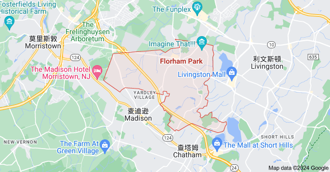

# 前言   有幸见证历史

很多人希望我能预测未来，这其实是做不到的，而且我一直在强调适应比预测更重要。

>   仙童公司（Fairchild Semiconductor）：

# 第一章   帝国的余晖 —— AT&T 公司

## 1   百年帝国

本小节简述了 AT&T 早期的发展历史。

### * 原文赏析

> 弗洛勒姆帕克占地十几平方公里，大多是芳草地和森林，在森林中央，是一片中等规模临湖的工业园 —— 这是笔者见过的最美丽的工业园。在那里，每天都能看到天鹅在湖中悠闲地游荡，有时还能见到野鹿出没。这里原是石油巨头埃克森美孚（ExxonMobil）的地产，1997 年，这里来了一个新主人 —— AT&T 实验室。1996 年，如日中天的 AT&T 公司重组，分离成 AT&T、朗讯（Lucent Technologies）和 NCR 三家公司。AT&T 旗下举世闻名的科研机构贝尔实验室也被一分为二。朗讯公司获得了一半的科研机构和贝尔实验室的名称。

> 1925 年，AT&T 公司成立了研发机构 —— **贝尔实验室（Bell Laboratories**，简称 Bell Labs）。贝尔实验室是历史上最大、最成功的私有实验室。AT&T 公司从电信业获得了巨额的垄断利润，将销售额的 3% 用于贝尔实验室的研发工作。在很长一段时间里，贝尔实验室总是用 “无须为经费发愁” 这一条理由来吸引优秀的科学家到该实验室工作，这使得贝尔实验室不仅在通信领域长期执牛耳，而且在射电天文学、晶体管和半导体、计算机科学等领域也都领先于世界，其闻名于世的发明包括射电天文望远镜、晶体管、数字交换机、计算机的 UNIX 操作系统和 C 语言等。此外，贝尔实验室还发现了电子的波动性，提出了信息论。

AT&T 全称 American Telephone and Telegraph Company，直译就是「美国电话电报公司」。公司本身名气于多数国人而言或许并不熟悉，但其创始人正是赫赫有名的电话之父亚历山大 · 贝尔（Alexander Bell）。

学过计算机的同学们应该会熟悉一个名为「贝尔实验室（Bell Laboratories）」的研发机构，这个发明了 UNIX 操作系统和 C 语言的实验室也正是 AT&T 旗下的。

### * 注释

- **新泽西州弗洛勒姆帕克（Florham Park, New Jersey）**：位于纽约西部，是美国新泽西州莫里斯县的一个行政区。

    

- **[联邦反垄断法](https://zh.wikipedia.org/wiki/%E7%AB%B6%E7%88%AD%E6%B3%95)**

## 2   几度繁荣

本小节讲述了 AT&T 与美国政府的司法部门的 “斗争史”，而吴军先生认为 AT&T 的衰败并不能归咎于反垄断。

### * 原文赏析

> 最值得一提的是，在第二次世界大战期间，贝尔实验室的天才青年科学家香农提出了信息论。信息论是整个现代通信的基础，并与控制论、系统论一道，成为信息时代的科学基础。……反垄断法逼着 AT&T 靠科技进步来提升自己的实力。我在 Google 总部曾接待了很多中国政府的领导干部，他们都关心为什么美国小公司能很快成为跨国公司，我认为其中一个原因是反垄断法逼着公司追求技术进步。当一家公司开始垄断一个行业时，它会更多地倾向于利用自己的垄断资源，而不是靠技术进步获得更多的利润，毕竟前者比后者容易得多。

## 3   利令智昏
